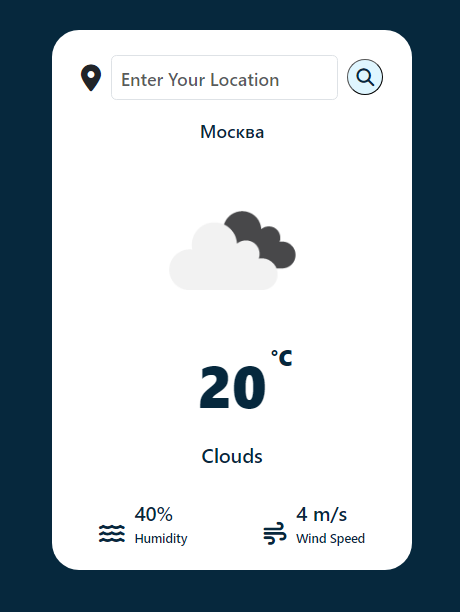

# Weather App

Simple weather app on django + openweatherapi

## Warning
You need to get your own api key on openweather website and replace it in views.py on line 5:

```python
api_key = "API_KEY"
```


# Screenshot
Here we have project screenshot :



### Use
```
$ git clone https://github.com/Icebeear/weather_app.git
$ cd weather_app/
$ pip install -r requirements.txt
$ cd app/
$ ./manage.py runserver
```
